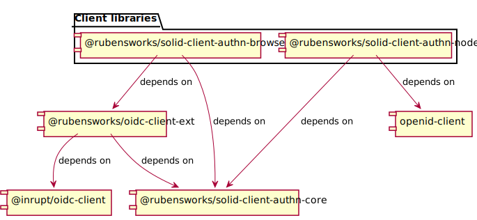
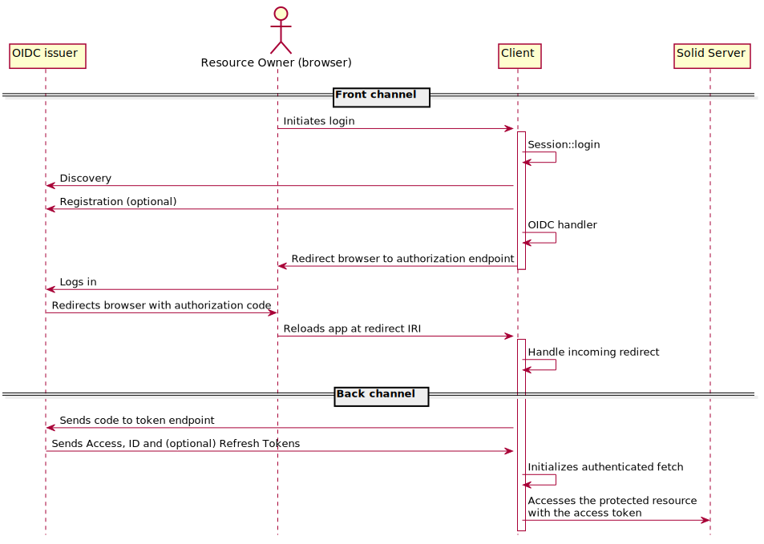
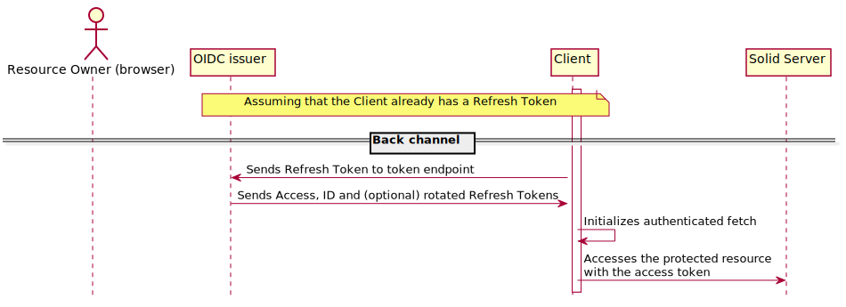

# Solid-client-authn-* architecture

This document summerizes the architecture of the `@inrupt/solid-client-authn-*`
modules. It applies to both `@inrupt/solid-client-authn-node` and `@inrupt/solid-client-authn-browser`, 
which are based on similar architectural patterns.

## Module map

https://github.com/inrupt/solid-client-authn-js is a lerna-based monorepo, which
means this single git repository actually hosts several NPM modules which are
related to each other. The following diagram shows an overview of the modules and their relations.



The two modules grouped under the "Client libraries" label are the
modules we expect our customers to import. As their names imply, each  of these modules is specific to a given environment (NodeJS or the browser). However, they both have a very similar API and architecture, and mostly
differ by their main dependency, namely the third-party library implementing the [OpenID Connect](https://openid.net/specs/openid-connect-core-1_0.html) protocol. `@inrupt/solid-client-authn-node` depends on [`openid-client`](https://github.com/panva/node-openid-client/). `@inrupt/solid-client-authn-browser` depends on [`oidc-client`](https://github.com/IdentityModel/oidc-client-js), but it does not implement all the features we needed, namely support for [DPoP tokens](https://tools.ietf.org/html/draft-ietf-oauth-dpop-01) and [Dynamic Client Registration](https://openid.net/specs/openid-connect-registration-1_0.html), which are implemented in `@inrupt/oidc-client-ext`.

The four modules are available in the [packages directory](./packages).

## OAuth2.0/OpenID Connect

This library aims at helping developers authenticating users to their applications using the [OpenID Connect](https://openid.net/specs/openid-connect-core-1_0.html) protocol (often abbreviated OIDC). OIDC is a protocol based on the [OAuth2.0](https://tools.ietf.org/html/rfc6749) framework. In order to understand the library, some understanding of OAuth/OIDC is preferable.

### Helpful resources

Here is a list of things that helped this library's developers get a better understanding of OAuth/OIDC: 
- [OAuth 2 in Action](https://www.manning.com/books/oauth-2-in-action), by Justin Richer and Antonio Sanso
- [OAuth masterclass](https://www.youtube.com/watch?v=egfyV2NV9Mw), by Justin richer
- [How To Securely Implement Authentication in Single Page Applications](https://betterprogramming.pub/how-to-securely-implement-authentication-in-single-page-applications-670534da746f), by Dennis Stötzel

### Solid-OIDC

Solid extends the OIDC protocol in order to make it fit into a decentralized ecosystem. The [Solid-OIDC specification](https://solid.github.io/authentication-panel/solid-oidc/) is the reference document to learn about this extension.

### A short glossary

Here is a list of terms having a specific meaning in the context of OIDC:
- **Resource Server**: The server hosting private resources. In our case, a Solid server. A Resource Server receives requests authenticated with an Access Token
- **Resource Owner**: the user, who owns some private resources 
- **OIDC issuer**: the Solid Identity Provider, which issues Access Tokens, ID tokens, and Refresh Tokens. These tokens tell the Resource Server that the user has control over a certain identity (WebID), which can then use that information to decide whether to give or deny access. Example: https://broker.pod.inrupt.com.
- **Client**: the application the Resource Owner uses to access its resources on the Resource Server. Technically, OAuth is a delegation protocol: the Resource Owner allows the Client to interact with the Resource Server on its behalf. Example: https://podbrowser.inrupt.com.

## Codemap of the client library modules

Most architectural specificities are found in both client libraries modules. This section will give a high-level description of the inner workings of both `@inrupt/solid-client-authn-node` and `@inrupt/solid-client-authn-browser`, leaving aside anything too module-specific.

### The API

Most of the code for these modules is internal, and hidden from the user. The public API is located in a file available directly in `packages/*/src/`, namely in the `Session.ts` file. Users are expected to build a `Session` object, and to use it to interact with the session. How users are expected to use the public API is documented in our [public documentation](https://docs.inrupt.com/developer-tools/javascript/client-libraries/tutorial/authenticate/).

### The Handler pattern

Important components of this library are based on the Handler design pattern: given data contained in a request, a set of classes implementing a similar API will declare whether or not they may handle said request. Handlers declare two functions: `canHandle(request)` and `handle(request)`. `canHandle` simply returns a boolean indicating the ability of the handler to handle the request, and `handle` actually processes it. All of the handlers for a given type of requests are tracked by a handler aggregator, which will have the first handle for which `canHandle` returns `true` process the request. The handler aggregator has the same API as the handlers it aggregates, and brokers the request to the underlying handlers. More on that in the Dependency Injection section.

In the context of this library, a request is an API to execute some OIDC-related operation. Handlers will determine whether they can handle the request based on the options specified by the user when making the call.

#### Login

Logging in is the operation that goes from the Client to the Issuer. It may result in a redirection of the user to the Issuer, but that is not always the case (in the `-node` module in particular). Handlers for the login operation are located in `packages/*/src/login/oidc/oidcHandlers/*Handler.ts`.

#### Incoming redirect

At the Issuer webpage, the Resource Owner authenticates (e.g. by entering a username and a password), after which the Issuer sends them to a webpage under the Client app's control (its `redirect_uri`), to which it appends some query parameters that it can use to complete the login flow. This is done when the developer calls `handleIncomingRedirect`, and the Handlers for the incoming redirect are located in `packages/*/src/login/oidc/redirectHandler/*Handler.ts`.

### Dependency injection

An important architectural component of this library is dependency injection, implemented here using [TSyringe](https://github.com/Microsoft/tsyringe). Dependencies are declared in `packages/*/src/dependencies.ts`.

#### Declaring order

Something important to realize is that the order in which the dependencies are declared (for a given container) matters. Let's have a look at some code to make things clearer.

```
container.register<IOidcHandler>("browser:oidcHandler", {
  useClass: AggregateOidcHandler,
});
container.register<IOidcHandler>("browser:oidcHandlers", {
  useClass: RefreshTokenOidcHandler,
});
container.register<IOidcHandler>("browser:oidcHandlers", {
  useClass: AuthorizationCodeWithPkceOidcHandler,
});
container.register<IOidcHandler>("browser:oidcHandlers", {
  useClass: ClientCredentialsOidcHandler,
});
```

Here, `AggregateOidcHandler` is the handler aggregator (as defined in the Handler Pattern section), and `RefreshTokenOidcHandler`, `AuthorizationCodeWithPkceOidcHandler` and `ClientCredentialsOidcHandler` are its underlying handlers. When receiving a request, `AggregateOidcHandler` will first call to its instance of `RefreshTokenOidcHandler` to check if it can handle it. If so, the instance of `RefreshTokenOidcHandler` will handle the request, and the instances of `AuthorizationCodeWithPkceOidcHandler` or `ClientCredentialsOidcHandler` will not be called. This means that it is important to declare the dependencies from the most specialized to the most generic, because if a fallback handler that can handle all requests is declared first, the other more specialized handlers will not be called.

#### Mocks and tests

Dependency injection makes the codebase more flexible, because it is only at runtime that each component will be presented with the dependencies it declared, which means it is easier to add a dependency to a component without changing the whole codebase.

However, mocking dependency injection in test code wouldn't bring any value. Instead, the object we want to test can be constructed with mocked dependencies provided to its constructor. For instance, a class such as

```
@injectable()
export default class RefreshTokenOidcHandler implements IOidcHandler {
  constructor(
    @inject("node:tokenRefresher") private tokenRefresher: ITokenRefresher,
    @inject("node:storageUtility") private storageUtility: IStorageUtility
  ) {}
  // ...
```

can be tested as follows: 
```
const refreshTokenOidcHandler = new RefreshTokenOidcHandler(
  someMockedTokenRefresher,
  someMockedStorageUtility
);
```

## Mapping OIDC flows to the code

### Auth code flow



- Discovery: `packages/*/src/login/oidc/IssuerConfigFetcher.ts`
- Registration: `packages/*/src/login/oidc/ClientRegistrar.ts`
- OIDC handler: `packages/*/src/login/oidc/oidcHandlers/AuthorizationCodeWithPkceOidcHandler.ts`
- Handle incoming redirect: `packages/*/src/login/oidc/redirectHandler/*Handler.ts`

### Refresh flow



- OIDC handler: `packages/*/src/login/oidc/oidcHandlers/RefreshTokenOidcHandler.ts`

Note that in this case, no redirection happens (i.e. there's only a Back channel exchange): the Access Token is received directly
as a response to the request containing the Refresh Token.
