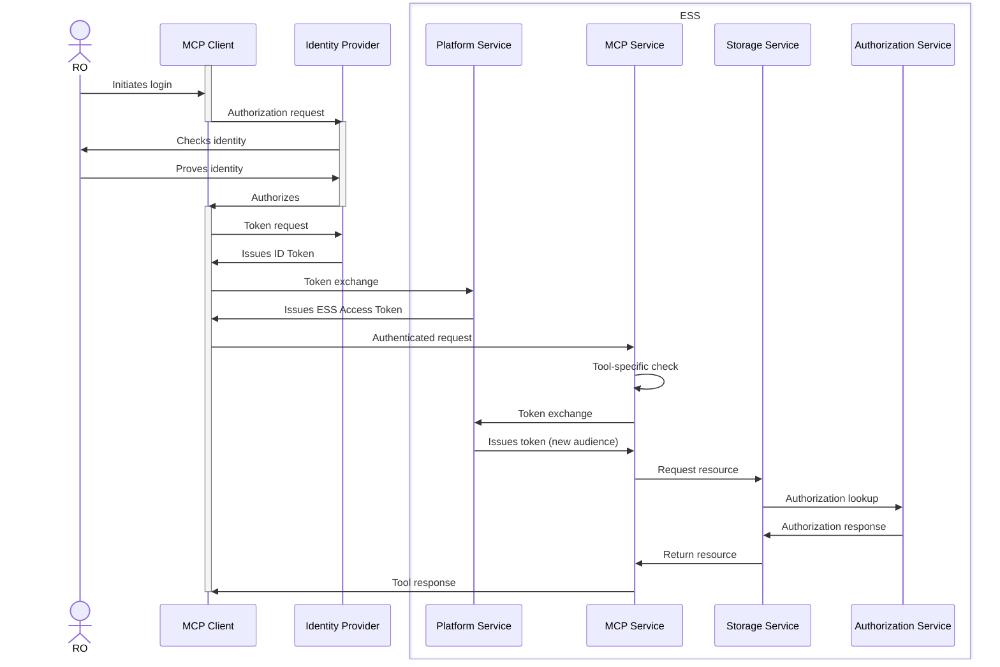

```mermaid
sequenceDiagram
    actor RO
    participant RP as MCP Client
    participant OP as Identity Provider
    box ESS
    participant AS as Platform Service
    participant MCP as MCP Service
    participant Storage as Storage Service
    participant Authorization as Authorization Service
    end
    activate RP
    RO->>RP: Initiates login
    RP->>OP: Authorization request
    deactivate RP
    activate OP
    OP->>RO: Checks identity
    RO->>OP: Proves identity
    OP->>RP: Authorizes
    deactivate OP
    activate RP
    RP->>OP: Token request
    OP->>RP: Issues ID Token
    RP->>AS: Token exchange
    AS->>RP: Issues ESS Access Token
    RP->>MCP: Authenticated request
    MCP->>MCP: Tool-specific check
    MCP->>AS: Token exchange
    AS->>MCP: Issues token (new audience)
    MCP->>Storage: Request resource
    Storage->>Authorization: Authorization lookup
    Authorization->>Storage: Authorization response
    Storage->>MCP: Return resource
    MCP->>RP: Tool response
    deactivate RP
```
